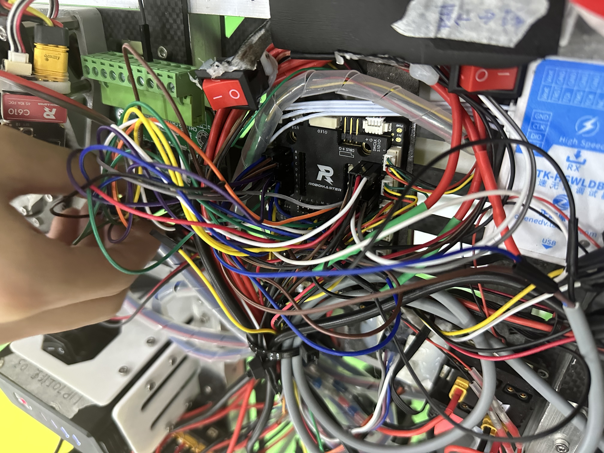
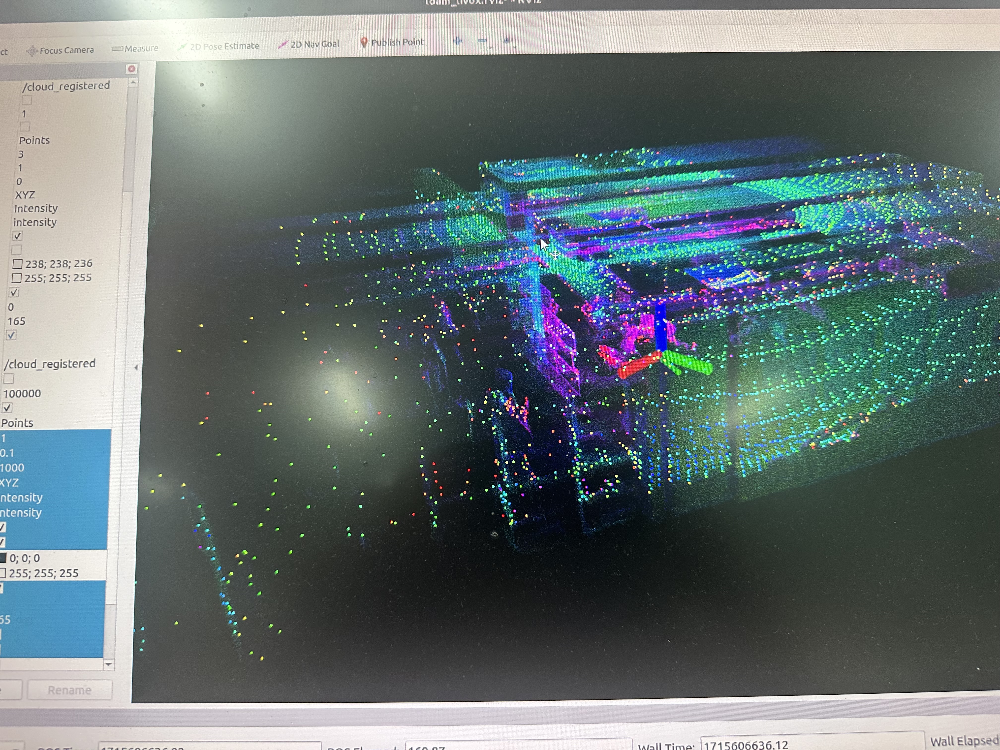

# Huangney 
我的Github_ID来源于我大一时写的一个聊天机器人（已开源），其使用`GRU`作为`Encoder`和`Decoder`的神经层，并带有注意力层。我使用了 **我和我朋友的聊天记录** 对其进行训练，最后这个机器人~~口吐芬芳，小嘴甜得像黄鹂~~，我便将其命名为`Huangney`

<figure>

<figcaption>杜邦线地狱！</figcaption>
</figure>

</style>
<figure>

<figcaption>扫扫实验室😋😋</figcaption>
</figure>

## 👀 关于我
我目前是一名自动化专业的大三学生，我热衷于探索新技术，不断挑战自我，努力提升自己的专业技能。

欢迎光临我的博客😄：[**AT-StarCorner**](https://www.atstarcorner.net/)

## 🤔 技术栈
在过去的几年中，我的主要工作领域为 ***嵌入式*** 方面，偶尔会写一些奇奇怪怪的东西玩（比如基于[NoneBot](https://nonebot.dev/docs/)架构的QQ机器人/ Pygame/ Unity小游戏）；此外我对 ***机器视觉***、***导航*** 等方面也有涉猎。 
### 编程语言
- 我最常使用的语言有：`C`、`C++`、`C#`、`Python`、`Matlab`等
- ~~`C#`是真的好用啊，又面向对象又声明齐全还可以编译，不过微软的.NET库太恶心了~~

### 框架和工具
- ***CubeMx + Keil + Vscode***
- ***Unity + Vscode*** 
- ***Pycharm + Anaconda*** 
- ***ROS***

## 📫 联系方式
- **电子邮件** 
  
  `QQ邮箱`：1260371422@qq.com

## ⚡ 代码统计

## 🎯 目标和愿景
我的目标是成为一名优秀的机器人工程师😜，通过技术解决实际问题，为社会做出贡献。我相信通过不断努力和积累经验，我能够实现自己的梦想。

感谢你访问我的 GitHub 主页！如果你对我的项目感兴趣，或者有任何建议和反馈，欢迎随时与我交流。    